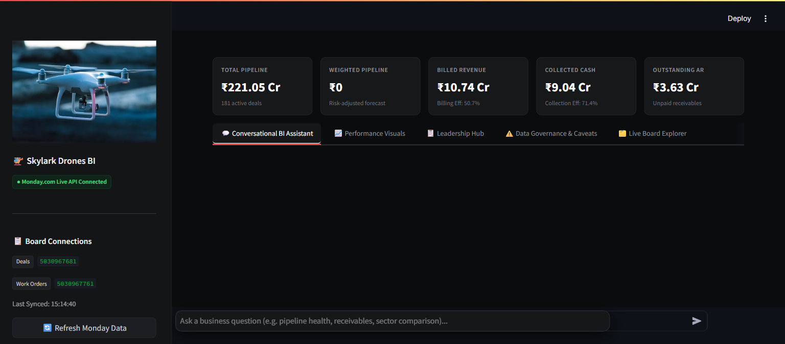
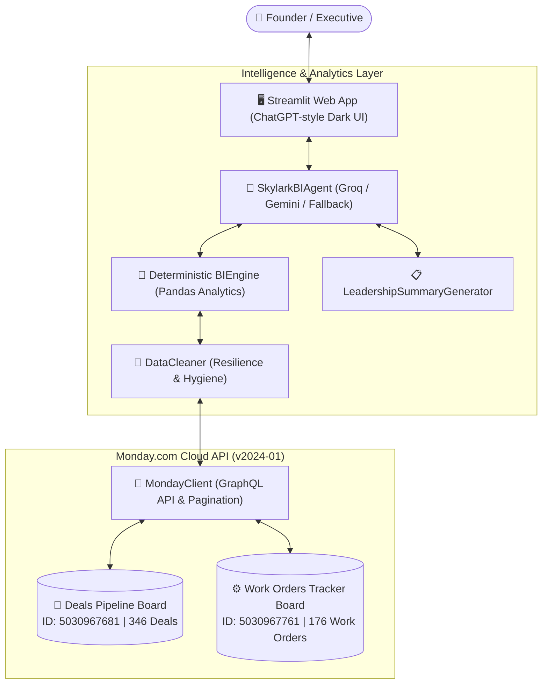

# 🚁 Skylark Drones — AI Business Intelligence Agent

[](https://share.streamlit.io/)
[](https://monday.com)
[](https://groq.com)
[](https://python.org)

> An enterprise-grade, conversational Business Intelligence Agent built for Skylark Drones executive leadership. The system dynamically connects to **monday.com** via GraphQL API, handles noisy real-world data across **Sales Pipeline (Deals)** and **Operations (Work Orders)** boards, performs deterministic financial and operational computations, and delivers strategic executive takeaways and leadership briefs.

---

## 📸 Live Application Preview



> **Obsidian Black & Charcoal Dark Theme** • **Live Monday.com GraphQL Integration** • **ChatGPT-style Conversational Interface**

---

## 🏛️ System Architecture



---

## ✨ Core Capabilities & Architectural Pillars

### 1. 🔌 Dynamic Monday.com GraphQL Integration
* **Zero Hardcoded CSVs**: Queries live Monday.com boards dynamically over HTTPS using the official GraphQL API (`v2024-01`).
* **Pagination & Rate-Limit Resilience**: Implements cursor-based pagination (`items_page` / `next_items_page`) with exponential backoff on HTTP 429 rate limits.
* **In-Memory TTL Caching**: Local caching layer with an on-demand **🔄 Refresh Monday Data** button to prevent redundant network overhead.

### 2. 🛡️ Data Resilience & Governance Disclosures
* **Type Normalization**: Cleans noisy currency formats (`₹264398.08`, `311989.7344`), varied probability strings (`20%`, `0.70`, `70`), and missing timestamps.
* **Caveats**: Identifies:
  - **346 Deals (100%)** missing closure probabilities (risk-adjusted weighted pipeline evaluated conservatively).
  - **23 Work Orders** marked "Completed" in operations with ₹0 billed (revenue recognition backlog alert).
  - **89 Work Orders (50.6%)** with missing invoice dates (collection timeline risk).

### 3. 📐 Deterministic Business Intelligence Engine
* **Arithmetic Decoupling**: Mathematical calculations (Totals, Averages, Efficiencies, Receivables) are executed in Python/Pandas to eliminate LLM arithmetic hallucinations.
* **Key Metrics Computed**:
  - **Total Pipeline**: ₹221.05 Cr across 181 open deals (Avg deal: ₹1.22 Cr).
  - **Billed Revenue**: ₹10.74 Cr (Billing Efficiency: **50.7%**).
  - **Collected Cash**: ₹9.04 Cr (Collection Efficiency: **71.4%**).
  - **Outstanding Receivables (AR)**: ₹3.63 Cr with concentration breakdown (*Faye Valentine* at ₹1.03 Cr, *Pumbaa* at ₹56.67 L).

### 4. 🔗 Multi-Board Cross-Correlation Matrix
* Correlates **Sales Demand (Deals)** with **Operational Fulfillment (Work Orders)**:
  - Identifies sectors with high pipeline demand but lagging operational capacity (e.g. *Aviation* with ₹17.62 Cr pipeline and 0 active work orders).
  - Detects cashflow bottlenecks where project execution is active but collections are stalled (e.g. *Powerline* with ₹12.15 L billed and ₹0 collected).

### 5. 📋 Executive Leadership Update Hub *(Bonus Requirement)*
* 1-click generation of comprehensive C-suite leadership briefs synthesizing:
  - **Executive Headline Pulse Check**
  - **Commercial & Pipeline Momentum**
  - **Operational Delivery & Backlog**
  - **Financial Realization & Receivables Risk**
  - **Data Quality Disclosures & Governance**
  - **4 Prioritized Founder Action Items** (Downloadable as Markdown).

---

## 📂 Project Structure

```
skylark-drones/
├── app.py                          # Streamlit application with ChatGPT Obsidian Black UI
├── config.py                       # Environment configuration & API credentials loader
├── DECISION_LOG.md                 # Required 2-page evaluation decision log
├── README.md                       # Architecture, setup, and deployment documentation
├── requirements.txt                # Python package dependencies
├── .env.example                    # Template for environment variables
├── modules/
│   ├── __init__.py
│   ├── monday_client.py            # Monday.com GraphQL API client & caching engine
│   ├── data_cleaner.py             # Data resilience, schema parsing & quality audit
│   ├── bi_engine.py                # Deterministic BI metrics calculation engine
│   ├── agent.py                    # Multi-LLM conversational reasoning agent
│   └── leadership_summary.py       # C-suite Executive Leadership Update generator
└── data/
    └── populate_monday_boards.py   # Automated Monday.com board provisioning script
```

---

## 🚀 Quick Start & Local Setup

### 1. Prerequisites
* Python 3.10 or higher
* A monday.com account with a Personal API Token

### 2. Installation
```bash
# Clone the repository
git clone https://github.com/<your-username>/skylark-drones-bi-agent.git
cd skylark-drones-bi-agent

# Install dependencies
pip install -r requirements.txt
```

### 3. Configure Environment Variables
Create a `.env` file in the root directory (or copy from `.env.example`):
```env
MONDAY_API_TOKEN=your_monday_personal_api_token
MONDAY_DEALS_BOARD_ID=5030967681
MONDAY_WORK_ORDERS_BOARD_ID=5030967761

GROQ_API_KEY=your_groq_api_key
GEMINI_API_KEY=your_gemini_api_key
```

### 4. Run the Application
```bash
streamlit run app.py
```
Open your browser at **`http://localhost:8501`**.

---

## 🌐 Deploy to Streamlit Community Cloud (1-Click)

1. Push your repository to **GitHub**.
2. Go to **[share.streamlit.io](https://share.streamlit.io)** and click **"New app"**.
3. Select your repository, branch (`main`), and set **Main file path** to `app.py`.
4. In **Advanced Settings → Secrets**, paste:
   ```toml
   MONDAY_API_TOKEN = "your_monday_api_token"
   GROQ_API_KEY = "your_groq_api_key"
   MONDAY_DEALS_BOARD_ID = "5030967681"
   MONDAY_WORK_ORDERS_BOARD_ID = "5030967761"
   ```
5. Click **Deploy** to get your public prototype link.

---

## 💬 Sample Query Gallery

| Category | Example Question |
| :--- | :--- |
| **Pipeline Health** | *"What is our total open sales pipeline value, and how many active deals do we have?"* |
| **Operational Fulfillment** | *"How many total work orders do we have, and what is our completed vs in-progress breakdown?"* |
| **Sector Comparison** | *"Compare the Powerline and Mining sectors in terms of pipeline, billing, and receivables."* |
| **Financial Risk** | *"Which specific work orders and clients represent our highest accounts receivable risk?"* |
| **Operational Leakage** | *"Do we have any work orders that are physically completed but have zero billed revenue?"* |
| **Data Governance** | *"Explain why our weighted pipeline is different from our total pipeline, and what data gaps exist."* |
| **Executive Reporting** | *"Prepare an executive leadership update for this quarter."* |

---

## 📄 Evaluation Deliverables

| Deliverable | File | Notes |
| :--- | :--- | :--- |
| **Hosted Prototype** | `[share.streamlit.io](https://share.streamlit.io)` | Deployed on Streamlit Community Cloud |
| **Decision Log (2-Page Max)** | [`DECISION_LOG.md`](DECISION_LOG.md) | Assumptions, trade-offs, leadership update interpretation |
| **Source Code & README** | This repository | Fully modularized Python package, PEP 8 compliant |
| **Live Screenshot** | [`docs/screenshot_dashboard.png`](docs/screenshot_dashboard.png) | Live app preview embedded above |
